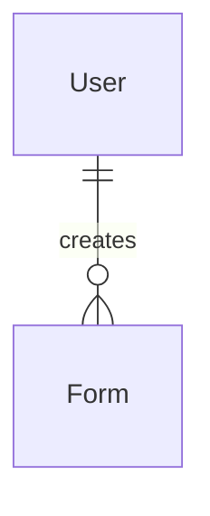

# Demo login

## Problem

Anyone who wants to see FormAI working has to register, wait for a confirmation email that expires
in 15 minutes, and click it before they can log in. A visitor who only wants to look around pays
that whole cost first, and the product gives them no way to try it without an account. The source
gives no conversion or drop-off figure.

After this ships, a visitor on `/login` clicks one prominent "Try demo" button and lands on the
dashboard in a throwaway sandbox account: no form to fill in, no email to confirm. The account is
marked as a demo, a banner tells them their forms last one day, and it points at registration
if they want to keep them.

## Flow

Reuses the login path end to end: `JwtService.GenerateAccessToken`, `RefreshToken` issuing,
`RefreshTokenCookie.Set`, `PasswordHasher` and `User.Create` all run as they do today; the demo
endpoint is `LoginHandler` without the credential check.

1. `LandingPage.tsx` and `LoginPage.tsx` (existing, changed) - both render one shared "Try demo"
   button component (new, placement); its click -> `startDemo()` in
   `frontend/src/api/auth.ts` (existing file, new function, placement) -> `POST /api/auth/demo`.
2. `AuthController` (existing, new action) - anonymous, `[EnableRateLimiting(RateLimitPolicies.Demo)]`
   (new policy, placement per the two existing ones) -> `StartDemoHandler`.
3. `StartDemoHandler` (new, `Application/Users/Auth/`, placement) - builds
   `User.CreateDemo(...)` (new factory on `User`, door 1) with a generated email, hashes
   `Demo:Password` through `IPasswordHasher` (exists), `IUserRepository.AddAsync` (exists), then
   issues the access and refresh token exactly as `LoginHandler` does, and hands back `AuthTokens`.
4. `AuthController` - `RefreshTokenCookie.Set` (exists), returns `200 { accessToken }`.
5. `JwtService.GenerateAccessToken` (exists, changed) - adds the `is_demo` claim only for a demo
   user (door 2). `RefreshTokenHandler` (exists) reaches the same method, so a refreshed token
   keeps the claim with no change of its own.
6. The shared button - `login(accessToken, userFromAccessToken(...))` (exists; the function now also
   reads `is_demo`), navigate to `/dashboard`.
7. `BasePage.tsx` (existing, changed) - reads `user.isDemo` from `useAuth()` and renders the demo
   banner above the page content.

## Impact

| Front | What changes |
| --- | --- |
| domain | new term: **Demo account** - a user created by `POST /api/auth/demo`, flagged `IsDemo`, auto-verified, holding a one-day sandbox. Lives in `FormAI.Domain/Entities/User`. Added to `CONTEXT.md` in the same change. |
| domain | existing behaviour: `IsEmailVerified` is now `true` for a user who never received or clicked a confirmation email. `LoginHandler` and every `IsEmailVerified` reader treat a demo user as any verified user. |
| stored data | one new flag on `users`, existing rows backfill to not-demo by the column default. Nothing else migrates. Demo accounts accumulate until the separate cleanup service exists. |
| docs | `docs/known-gaps.md` gains a row for demo accounts never being cleaned up. `CLAUDE.md` "Business rules" gains the demo rules. `CONTEXT.md` gains **Demo account**. |
| auth | the access token gains an optional claim, `is_demo`. Nothing that validates tokens reads it. |

## Relations

One-way constraint: `User` gains a required demo flag that defaults to false (door 1). No new
entity.

## Surface

| Route | In | Out | Status |
| --- | --- | --- | --- |
| `POST /api/auth/demo` | none (empty body) | `accessToken` and the refresh cookie, as `POST /api/auth/login` | `200`, `404`, `429` |

## Landing

| One-way door | Literal shape | Alternative rejected |
| --- | --- | --- |
| 1. The demo flag is persisted on the user | `users.is_demo boolean not null default false`; `User.IsDemo` with a `private set`, set only by `User.CreateDemo` | Recognising demo users by an email pattern such as `@demo.invalid` - a real user can register an address that matches, and the cleanup service would then delete a real account. A separate `demo_users` table - the flag is one bit on a row every existing query already loads, and a second table forces a join on every login. |
| 2. The `is_demo` claim on the access token | claim name `is_demo`, value `"true"`, present only for a demo user and absent otherwise; the frontend decodes it in `userFromAccessToken` | A `GET /api/me` call after login - the frontend has no such endpoint and `userFromAccessToken` already decodes `sub`, `name` and `email` from the token, so a second round trip is a new pattern. A claim always present with `"false"` - every existing token in flight lacks it, so the frontend would have to treat "absent" as false anyway. |

- Nothing else in this change is hard to reverse: the demo email shape, the rate
  limit numbers and the banner copy are constants or configuration.

## Criteria

### S1: One click starts a demo session (P1)

`POST /api/auth/demo` creates a fresh demo account and signs the caller in.

**Acceptance Criteria**

1. WHEN `POST /api/auth/demo` is called and `Demo:Password` is configured THEN the system SHALL
   create a user with `IsDemo` true, `IsEmailVerified` true, `VerifiedAt` set, the name
   `Demo user`, the email `demo-<guid>@demo.invalid` and a password hash of `Demo:Password`, and
   respond `200 { accessToken }` with the refresh cookie set exactly as `POST /api/auth/login` sets it.
2. WHEN a demo user is created THEN the system SHALL NOT send any email and SHALL NOT create a
   `UserConfirmationToken`.
3. WHEN `POST /api/auth/demo` is called twice THEN the system SHALL create two users with
   different ids and different emails, and each access token SHALL carry its own user's `sub`.
4. WHEN a demo user's access token is issued THEN the system SHALL
   include the claim `is_demo` with the value `"true"`, at demo start and at refresh.
5. The system SHALL NOT include the `is_demo` claim in the access token of a user who is not a
   demo user.
6. IF `Demo:Password` is not configured or blank THEN `POST /api/auth/demo` SHALL respond `404` and
   SHALL NOT create a user.
7. IF one client exceeds the demo rate limit THEN the system SHALL respond `429` with
   `{ message, errors: null, code: null }` and SHALL NOT create a user, the limit being
   `RateLimiting:Demo:PermitLimit` calls per `RateLimiting:Demo:WindowMinutes` to `POST /api/auth/demo`.
8. WHEN `POST /api/auth/login` is called with a demo user's email and `Demo:Password` THEN the system SHALL succeed like any verified user's login.

**Independent test:** call `POST /api/auth/demo` twice, decode both tokens, and see two different
`sub` values and `is_demo` `"true"` in each.

### S2: "Try demo" is the most prominent action on the landing and login pages (P1)

**Acceptance Criteria**

9. WHILE the user is on `/login` the system SHALL render a full-width "Try demo" button in the
   `primary` variant above the email and password fields, and the form's submit button SHALL
   render in the `outline` variant.
9a. WHILE the user is on `/` the system SHALL render, first in the hero button row, a "Try demo"
   button in the `primary` variant at the size of the existing hero buttons, and "Start for free"
   SHALL render in the `outline` variant.
10. WHEN the user clicks "Try demo" and the request succeeds THEN the system SHALL sign in with the
    returned token and navigate to `/dashboard`.
11. WHILE the demo request is in flight the system SHALL show "Try demo" in its loading state, and
    a second click SHALL NOT send a second request.
12. IF the demo request fails THEN the system SHALL show the server's `message`, or
    `Could not start the demo. Please try again.` when there is none, next to the button
    (in the login form's error box on `/login`), and SHALL stay on the current page.

**Independent test:** open `/` or `/login`, click "Try demo", land on `/dashboard` without typing anything.

### S3: A demo user is told the account is temporary (P1)

**Acceptance Criteria**

13. WHILE the signed-in user is a demo user the system SHALL render, on every page that uses
    `BasePage`, a banner reading `You're using a demo account. Your forms are only available for
    1 day. Create an account to keep them.` where "Create an account" links to `/register`.
14. WHILE the signed-in user is not a demo user the system SHALL NOT render that banner.
15. WHILE the signed-in user is a demo user the banner SHALL have no dismiss control.

**Independent test:** sign in through "Try demo", see the banner on the dashboard and on the
create-form page; sign in with a normal account and see neither.

## Out of scope

| Excluded | Why |
| --- | --- |
| The background service that deletes old demo accounts and their forms | Stated by the owner as a separate piece of work; the flag in door 1 is what it will query. |
| A shorter expiry for demo users' forms | Not needed: a demo user's forms are deleted with the account by the separate cleanup service, whatever their expiry. |
| Turning a demo account into a real one (keeping its forms on sign-up) | The owner ruled it out. The banner sends the user to `/register`, which creates a separate account; the demo forms are not carried over. |
| A separate, tighter form-generation budget for demo users | The owner decided it is not needed now. |
| Blocking `POST /api/auth/login` for demo accounts | The owner wants the shared password to work for inspection. |

## Assumptions

| Assumption | Chosen default | Rationale | Confirmed? |
| --- | --- | --- | --- |
| Demo email domain | `demo-<guid>@demo.invalid` | `.invalid` is reserved by RFC 2606 and never resolves, so no email can leave for it and no real user owns one | n |
| Rate limit numbers | `PermitLimit` 10, `WindowMinutes` 15, `SegmentsPerWindow` 3, per IP | Loose enough for several people behind one office IP, tight enough to stop a loop creating rows and Claude budget | n |
| Demo display name | `Demo user` for everyone | The header shows `user.name`; nothing else needs a per-visitor name | n |
| Banner is not dismissible and stays on every `BasePage` screen | always visible | The warning is the point of the feature; a dismissed warning is a lost form | n |
| The "Create an account" link goes to `/register` without signing the demo user out | plain link | `/register` has no auth guard today; signing out is an extra behaviour nobody asked for | n |
| Missing `Demo:Password` turns the feature off | `404`, and the button shows the failure message from criterion 12; the value `DemoUser852*` (owner-given) goes in the untracked `appsettings.Development.json`, not the tracked `appsettings.json` | No default password may ship in `appsettings.json`; the feature is off until configured | n |

**Open questions:** one, below - it does not block the build.

| # | Kind | Question | Until answered |
| --- | --- | --- | --- |
| 1 | blocks go-live | Which secret store carries `Demo:Password` in production (ECS task definition or secret)? Locally it is `DemoUser852*` in `appsettings.Development.json`. | The endpoint answers `404` and the button shows its error, in that environment |

## Observable

| Surface | Decision | Landing |
| --- | --- | --- |
| screen `/login` | empty state | n/a - the form is always rendered, nothing is listed |
| screen `/login` | loading state | AC 11 |
| screen `/login` | error state | AC 12 |
| screen `/login` | unauthorised state | n/a - the page is public by design |
| screen `/login` | density and ordering | AC 9 |
| screen `/login` | destructive action confirms | n/a - starting a demo destroys nothing |
| screen `BasePage` banner | empty, loading and error states | n/a - static copy driven by a token claim already in memory |
| screen `BasePage` banner | ordering and dismissal | AC 13, 15 |
| screen `/` | states and ordering | AC 9a, 11, 12 (no list, so no empty state: n/a - static page) |
| API `POST /api/auth/demo` | response shape | AC 1 |
| API `POST /api/auth/demo` | error shape and codes | AC 6, 7 |
| API `POST /api/auth/demo` | who may call it | n/a - anonymous by design, like `Register` and `Login` on the same controller |
| API `POST /api/auth/demo` | versioning | n/a - no API versioning scheme exists in this codebase |
| API `POST /api/auth/demo` | what happens at the rate limit | AC 7 |

## Sources

- User's task description (this conversation) - the button, the banner text, the one-day
  sandbox, the shared configured password, the `IsDemo` flag, and the separate cleanup service.
- `CLAUDE.md` "Business rules" and `docs/known-gaps.md` - the rules the demo changes and the gaps it adds to.
