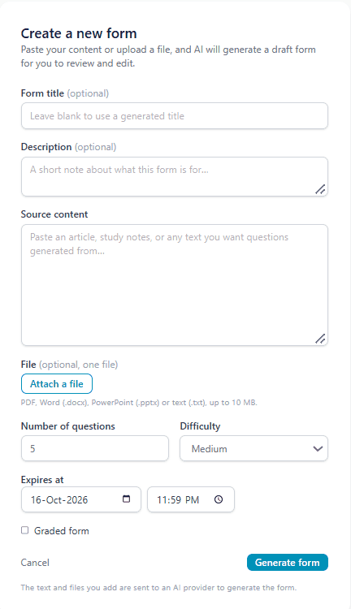
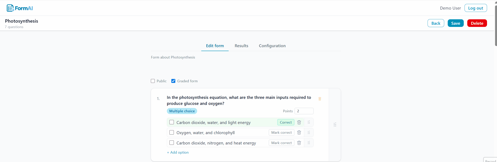
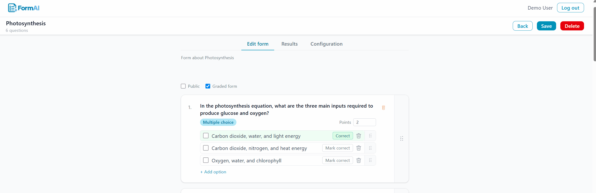
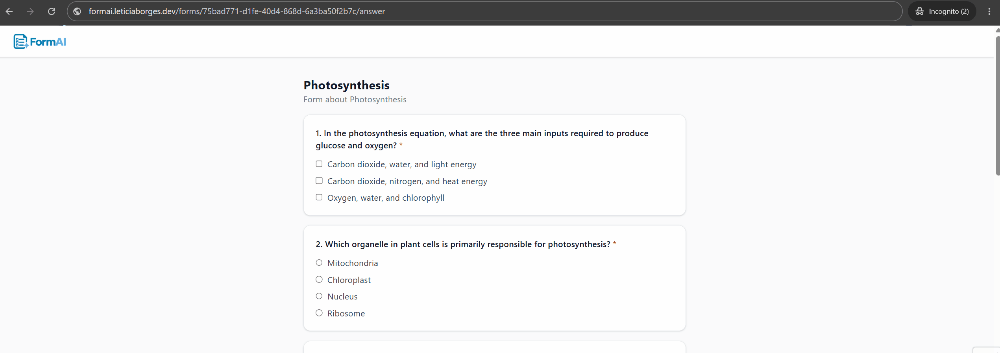
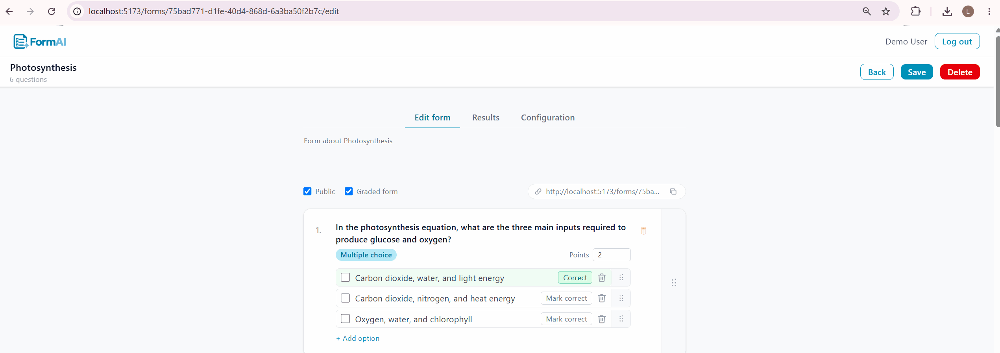
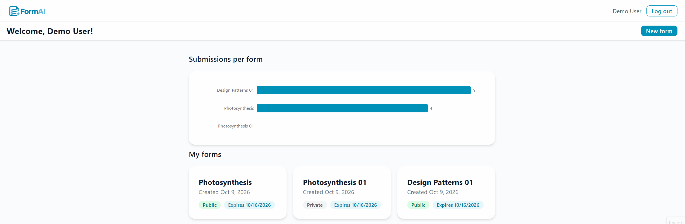
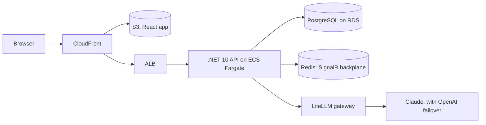

# FormAI

**Turn your presentation into a quiz in seconds, then see what your audience actually understood.**

🔗 **Live demo:** [formai.leticiaborgesdev.com](https://formai.leticiaborgesdev.com)

Click **Try demo** to get a temporary account in one click, with no sign-up or email needed.
Forms created with a demo account are available for one day.

💡 To see the live results, publish a form, open its link in a private window, answer it,
and watch the Results tab update.

## The problem

You just gave a class, a training session or a presentation at work. Did people get it?
Writing good questions by hand takes time, so most of the time nobody checks.

FormAI takes the material you already have (your slides, notes or a document), drafts
the questions for you, and gives you a link to share with your audience. You review the
questions, publish, and watch the answers come in.

**Who it's for:** teachers checking understanding after a class, trainers and speakers
after a session, and teams after a knowledge-sharing meeting.

## How it works

**1. Upload your content.** Attach your slides (PPTX), a PDF, a Word document or a text file,
or paste your notes. Choose how many questions, the difficulty, and whether the quiz is graded.

**2. Review the draft.** AI generates the questions. Edit them, reorder them, mark the right
answers and set points before anyone sees them.

**3. Share the link.** Publish the form and send the link to your audience.

**4. Your audience answers.** They open the link and answer once, signed in or anonymously.

**5. See the results live.** Answer distributions per question, score distribution on graded forms,
and each individual submission. The results page updates as answers arrive.

**6. Keep track of your forms.** The dashboard lists all your forms and how many submissions each has.

## Under the hood

A full-stack .NET and React application, deployed on AWS.

- **Backend:** .NET 10, Clean Architecture, EF Core with PostgreSQL, JWT with rotating refresh tokens in HttpOnly cookies
- **Frontend:** React 19, TypeScript, Vite, Tailwind CSS
- **Real time:** SignalR with a Redis backplane for the live results page
- **AI:** models behind a LiteLLM gateway with provider failover, a strict JSON schema on the output, and validation before anything is saved
- **Infrastructure:** AWS (ECS Fargate, RDS, ElastiCache, CloudFront, Route 53) provisioned with Terraform; CI/CD with GitHub Actions, with database migrations run as a separate step under a dedicated role
- **Testing:** xUnit and NSubstitute, integration tests with Testcontainers, Vitest for components, Playwright end to end
- **Safeguards:** per-user and per-IP rate limiting, and 404s that don't reveal whether a form exists

Design decisions and their trade-offs are recorded in [`docs/adr/`](./docs/adr/).

## How it was built

I built FormAI working alongside [Claude Code](https://claude.com/claude-code). I set the direction and
made the product and architecture decisions, and we worked through the implementation together: exploring
options, writing and refactoring code, and keeping the documentation current. The workflow:

1. **Shape the idea.** Before writing code, a `grill-me-with-docs` session challenged the requirements and
   edge cases, and settled the domain vocabulary in [`CONTEXT.md`](./CONTEXT.md).
2. **Plan before changing code.** Non-trivial changes started in plan mode: Claude Code read the relevant
   code and proposed an approach, and nothing was edited until I approved it.
3. **Specify features when it pays off.** The approach depended on the feature. Some were specified first:
   with `tlc-spec-driven`, a spec with testable requirements was broken into tasks and validated against
   them; the lighter `tlc-spec-lean` used a single plan with acceptance criteria, checks written before the
   build, then an independent verification. Other changes went straight from plan mode to code. The specs
   are in [`.specs/`](./.specs/).
4. **Verify.** Changes go through unit, integration and end-to-end tests, and CI runs on every pull request.
5. **Keep the context true.** [`CLAUDE.md`](./CLAUDE.md) describes the architecture and business rules as
   built, and is updated in the same change as the code, so later work starts from accurate context.
   Decisions that were hard to reverse were recorded as ADRs.

## Running it locally

See [`DEVELOPMENT.md`](./DEVELOPMENT.md) for setup, configuration and tests.

## Documentation

| File                                                     | What it holds                                            |
| -------------------------------------------------------- | -------------------------------------------------------- |
| [`DEVELOPMENT.md`](./DEVELOPMENT.md)                     | Local setup, configuration, tests and commands           |
| [`CONTEXT.md`](./CONTEXT.md)                             | The glossary — what each domain term means               |
| [`CLAUDE.md`](./CLAUDE.md)                               | Architecture, business rules as implemented, conventions |
| [`docs/adr/`](./docs/adr/)                               | Why the non-obvious decisions were made                  |
| [`docs/known-gaps.md`](./docs/known-gaps.md)             | What isn't built                                         |
| [`.specs/`](./.specs/)                                   | Feature specs, checks and verification reports           |
| [`docker/litellm/README.md`](./docker/litellm/README.md) | The AI gateway: aliases, failover, timeouts              |

## License

[MIT](./LICENSE)
